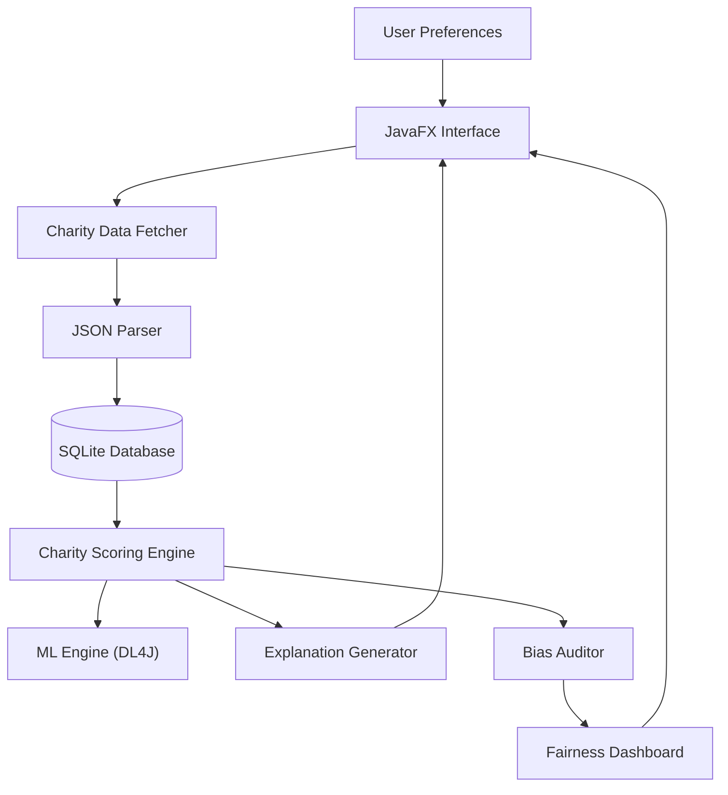
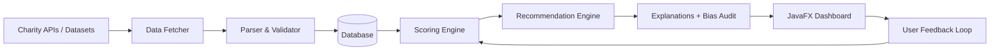

# Algorithmic Philanthropy Advisor

The **Algorithmic Philanthropy Advisor (APA)** is a Java-based AI application that helps users make ethical and impactful charitable giving decisions. It prioritises **transparency, fairness, and explainability**, offering a polished and intuitive interface for meaningful user experiences.

---

## Features
- **Charity Evaluation**  
  Aggregates and updates verified charity data (impact effectiveness, overhead costs, transparency).  

- **Explainable Recommendations**  
  Ranks charities using multi-criteria algorithms (weighted scoring, AHP) with clear rationales.  

- **Personalization**  
  Users define giving priorities (causes, regions, overhead limits).  

- **Fairness Auditing**  
  Automatic bias checks with visual dashboards.  

- **Privacy**  
  No sharing of user preferences or data.  

- **Polished Design**  
  JavaFX GUI with minimalistic dashboards, charts, and statistics.  

---

## System Architecture

## Project Structure
/algorithmic-philanthropy-advisor
├── src/main/java/com/apa/

│   ├── MainApp.java         # Entry point

│   ├── gui/                 # JavaFX views & controllers

│   ├── model/               # Core data models

│   ├── data/                # Fetchers, parsers

│   ├── engine/              # Scoring, explanations

│   ├── audit/               # Bias auditing

│   ├── ml/                  # ML integration

│   └── storage/             # Database layer

├── resources/               # FXML, configs, sample data

├── docs/                    # Documentation & diagrams

└── README.md

## Tech Stack

Java 17+

JavaFX (GUI)

SQLite + JDBC (Database)

Jackson / Gson (JSON Parsing)

Deeplearning4j (ML Integration)

ChartsFX / XChart (Visualisation)

Maven / Gradle (Build)

## Development Roadmap

Week 1 – Research datasets, skeleton project setup

Week 2-3 – Data fetcher, storage, scoring engine

Week 4 – GUI development & dashboards

Week 5 – Integration & testing

Week 6 – ML integration, optimisation, documentation

## Contributors

ML Developer (Mukti Shree Jain) – Recommendation Engine, ML

Backend (Ayush Aryan) – Data Fetcher, Database

Frontend (Vivek Kumar Prusty) – GUI, Dashboards

Documentation/Testing (Ritvik Verma) – Setup, Docs, Q/A

## Ethical Principles

Transparency – Algorithm logic and data sources are open
Explainability – Every recommendation has a clear rationale
Fairness – Regular bias audits with public results
Privacy – Full user control over data;

## Conclusion

The Algorithmic Philanthropy Advisor showcases how ethical AI can transform philanthropy.
Blending impact, fairness, and trust with an elegant design, it makes giving more accountable, data-driven, and user-centric.
